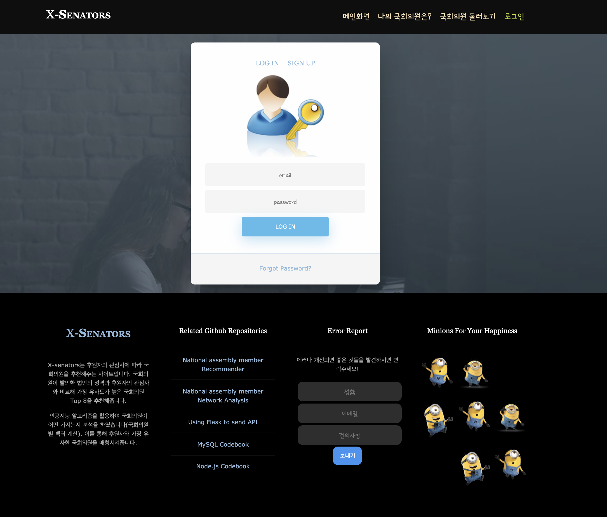
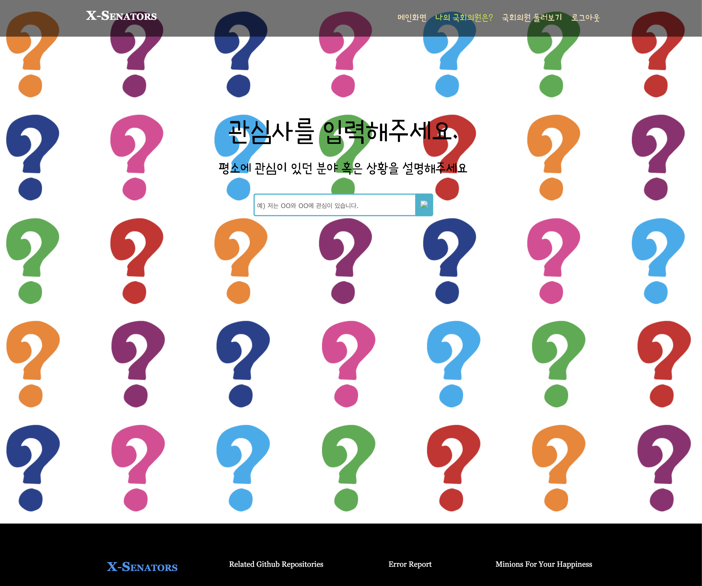
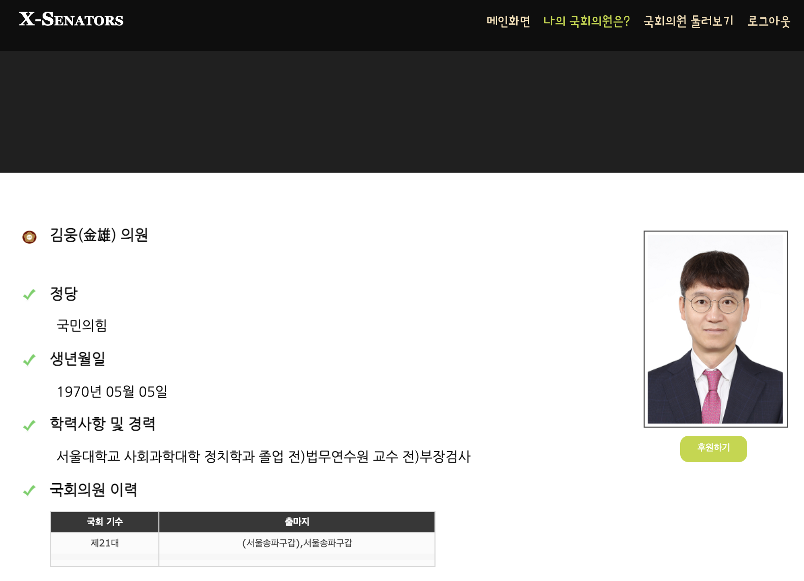
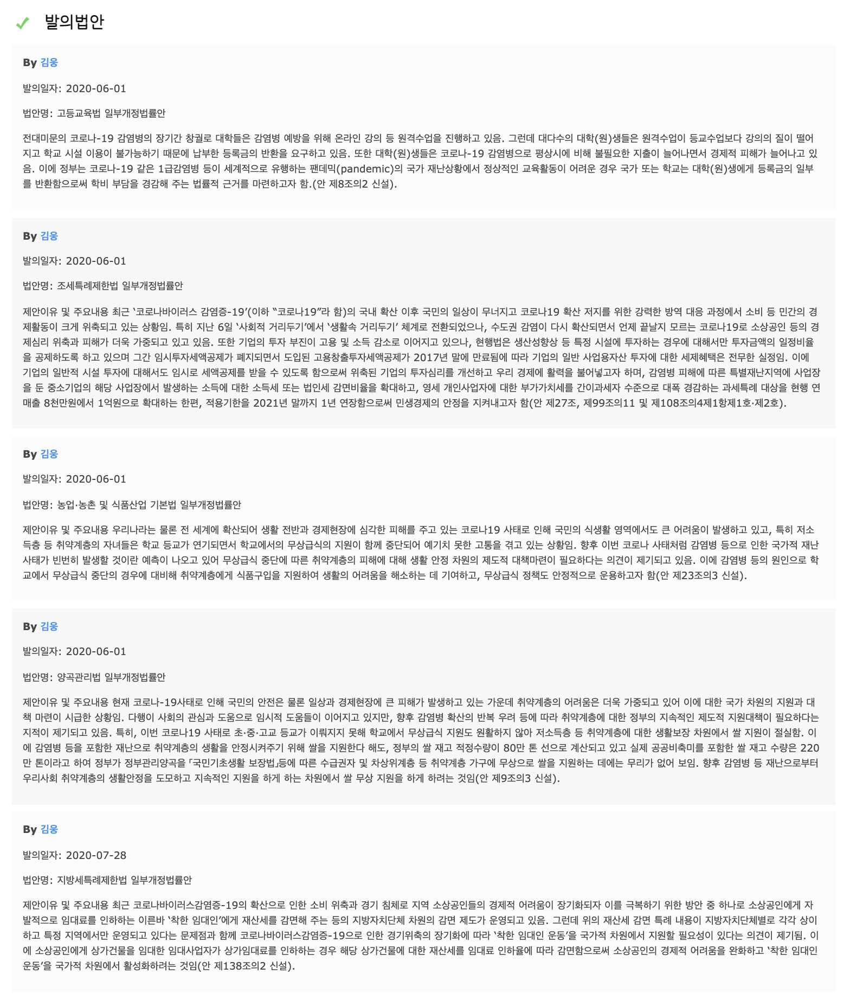
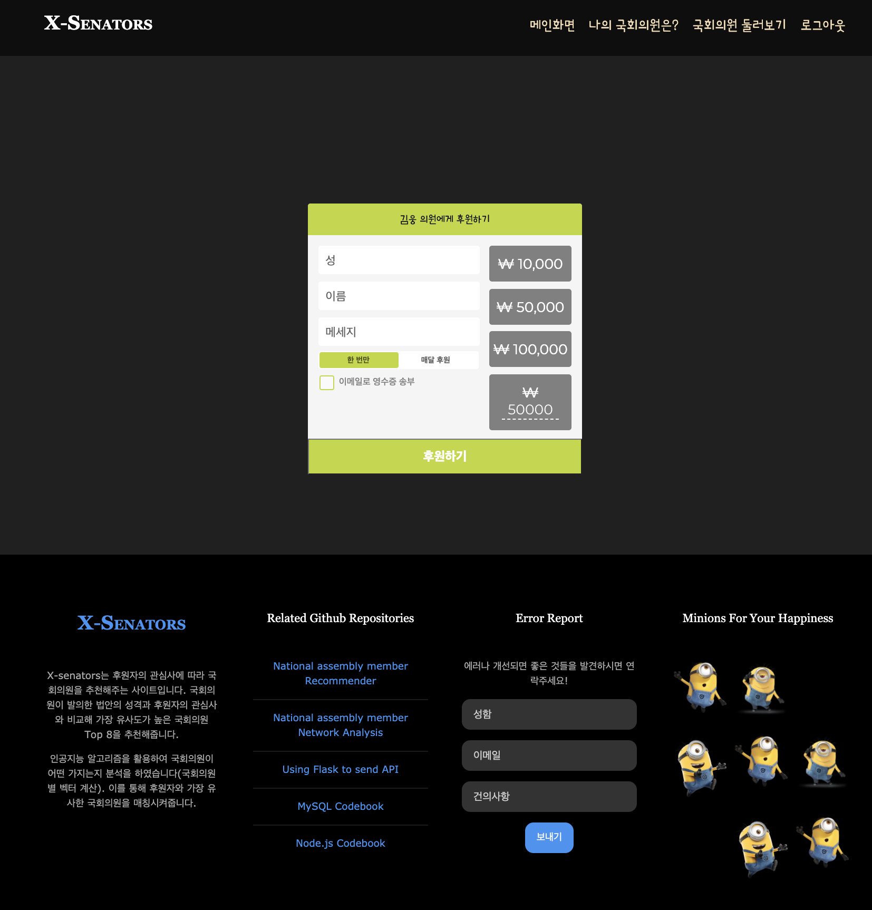
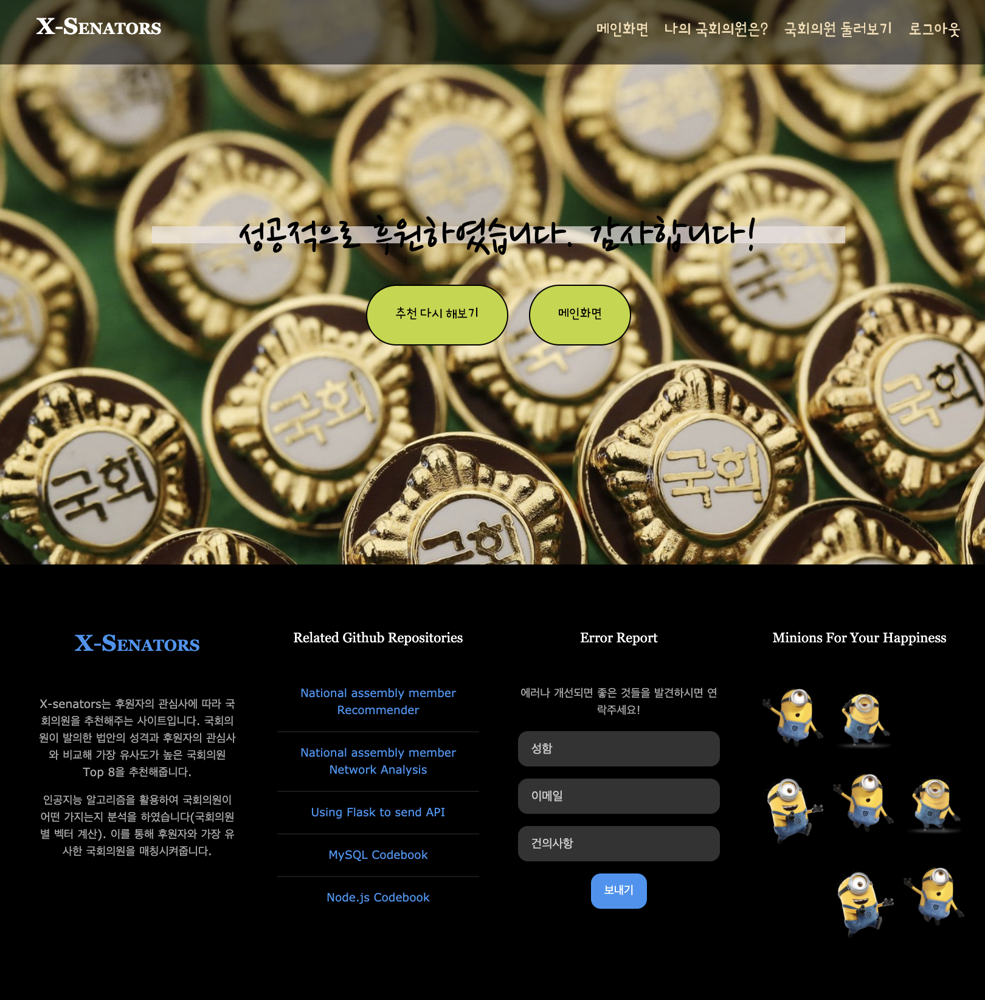

<h1 align="center"><strong>🔎 X-senators (국회의원 추천 Web)</strong></h3>

`#node` `#NLP` `#word2vec` `#Fasttext` `#Flask` 

# 🚦 1. X-senators 서비스 소개
- 개요: 현재 정치후원금은 1인당 800원으로 매우 저조한 상태이다. '자신과 맞는 국회의원이 누군지 몰라서 그런 게 아닐까?'하는 생각에 후원자에게 맞는 국회의원을 추천해주는 X-senators를 생각하게 됨
- 목적: 후원자의 관심사와 가장 유사한 국회의원을 추천해줘 '누구에게 후원금을 줘야할지?'에 대한 고민에 답을 주고자 함

# 🚦 2. 추천방식
- 모델: Fasttext, Word2vec 중 택 1
- Doc2vec을 사용해보았으나 국회의원 벡터가 매우 안 좋게 나왔음

## 2-1) 국회의원 벡터 생성
- Fasttext, Word2vec 모델로 모든 법안의 단어들을 임베딩시킴
- 법안에 들어가는 단어 벡터를 모두 더해서 법안 벡터를 생성하였음
- 한 국회의원이 발의한 모든 법안 벡터를 가중평균 내어 국회의원벡터를 만들었음

## 2-2) 사용자 벡터 생성
- 사용자가 관심사를 입력 받음
- 사용자 벡터를 mecab으로 tokenize를 하고 이미 학습된 단어모델의 벡터를 전부 합함

# 🚦 3. Web 시연화면
<h3 align="center"><strong>(1) 메인화면 접속하기</strong></h3>

 

<h3 align="center"><strong>(2) 로그인 하기!</strong></h3>

<h4 align="center"><strong>로그인을 해야 국회의원 추천결과를 받아볼 수 있습니다</strong></h4>

 

<h3 align="center"><strong>(3) 관심사 입력하기</strong></h3>
<h4 align="center">오른쪽 위 '나의 국회의원은?' 배너에 들어가면 사용자 관심사를 입력하는 창이 나옵니다.</h4>
<h5 align="center">예시) 중소기업 운영하고 있는 사장입니다. 코로나 때문에 많이 힘듭니다. 자영업자들에게 지원을 해주셨으면 합니다.</h5>

 

<h3 align="center"><strong>(4) 국회의원 추천결과</strong></h3>
<h4 align="center"><strong>추천된 국회의원과 사용자와의 유사도가 나옵니다.</strong></h4>

 

<h3 align="center"><strong>(5) 국회의원 정보 살펴보기 - Demographic 정보</strong></h3>
<h4 align="center"><strong>Top8 국회의원 중에서 자세히 보고싶은 국회의원을 클릭하면 다음과 같이 국회의원 정보가 나옵니다.</strong></h4>

 

<h3 align="center"><strong>(5) 국회의원 정보 살펴보기 - 법안</strong></h3>
<h4 align="center"><strong>국회의원이 발의한 법안 중 사용자의 관심사와 가장 유사한 법안 5개가 나옵니다.</strong></h4>

 

<h3 align="center"><strong>(6) 후원하기 </strong></h3>
<h4 align="center"><strong>국회의원 사진 밑에 후원하기 버튼을 누르면 다음과 같이 후원창이 나옵니다.</strong></h4>
<h4 align="center"><strong>성, 이름, 메세지, 금액, 영수증 등을 체크하시고 '후원하기' 버튼을 누르면 됩니다.</strong></h4>

 

<h3 align="center"><strong>(7) 성공적인 후원!</strong></h3>
<h4 align="center"><strong>'후원하기' 버튼을 누르면 후원 성공창이 뜹니다.</strong></h4>
<h4 align="center"><strong>결제 API는 연결하지 않아서 가상으로 후원을 하는 것이고 MySQL DB에 sponsorSenators 테이블에 후원정보가 입력됩니다.</strong></h4>

 

# 🚦 4. 직접 Web 시연해보기

<h3 align="center"><strong>끗! 🙌</strong></h3>
